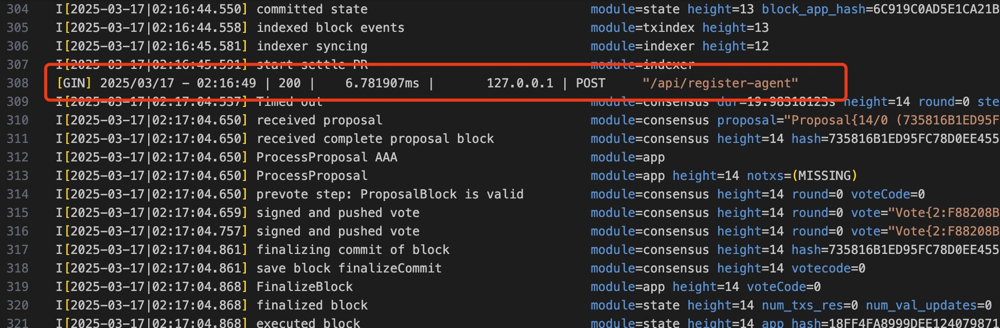
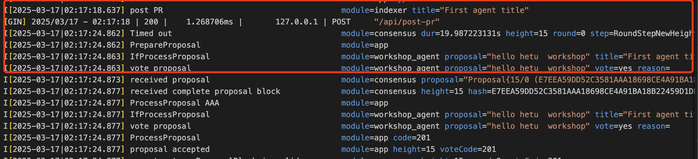
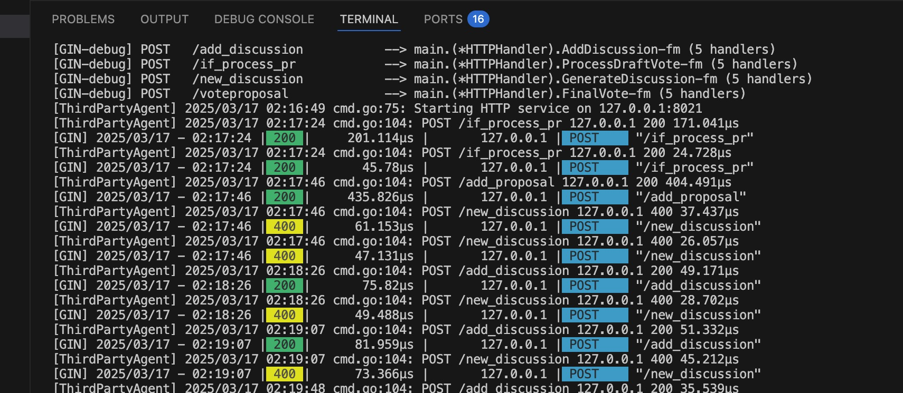

## Run-manual

### Running the HAC Node

#### First, build and start the Hetu Chaos Chain node:

```
cd   hac-node
make build
```

#### Then, start the hac-node:
```
cd   script/
chmod +x local-hac-nodes.sh
./local-hac-nodes.sh
```
Note: The system currently starts 3 nodes by default. If you need to change this number, please modify the NUM_NODES count in the local-hac-nodes.sh file.

After all nodes are successfully running, you will see the node output information in the hac-node/build/out3.


### Running the Agent Client

#### In a new terminal, build and run the sample applications:
```
cd samples/
make build
cd ./build
./samples start         
```
This will start the agent client. You can monitor the output to see the system's operation.




#### In a new terminal, Creating a New Proposal in samples/build

To create a new proposal using the sample client:
```
cd samples/build  // Go to the build directory
./samples   propose --title "First agent title" --data "hello hetu  workshop"   
```
This command sends a new proposal to the chain with the specified title and data. 



you can monitor the output in the previous terminal to see the system's operation.

